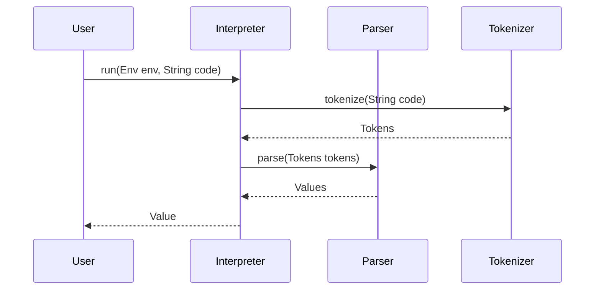
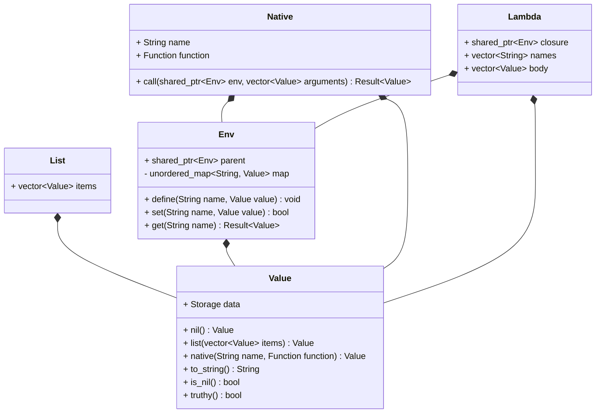

# `lisp`

```mermaid
sequenceDiagram
    participant User
    participant Interpreter
    participant Parser
    participant Tokenizer
    User->>Interpreter: run(Env env, String code)
    Interpreter->>Tokenizer: tokenize(String code)
    Tokenizer-->>Interpreter: Tokens
    Interpreter->>Parser: parse(Tokens tokens)
    Parser-->>Interpreter: Values
    Interpreter-->>User: Value
```

```mermaid
classDiagram
    class List {
        + vector~Value~ items
    }
    class Value {
        + Storage data
        + nil() Value
        + list(vector~Value~ items) Value
        + native(String name, Function function) Value
        + to_string() String
        + is_nil() bool
        + truthy() bool
    }
    class Env {
        + shared_ptr~Env~ parent
        - unordered_map~String, Value~ map
        + define(String name, Value value) void
        + set(String name, Value value) bool
        + get(String name) Result~Value~
    }
    class Native {
        + String name
        + Function function
        + call(shared_ptr~Env~ env, vector~Value~ arguments) Result~Value~
    }
    class Lambda {
        + shared_ptr~Env~ closure
        + vector~String~ names
        + vector~Value~ body
    }
    List *-- Value
    Env *-- Value
    Native *-- Value
    Native *-- Env
    Lambda *-- Value
    Lambda *-- Env
```
