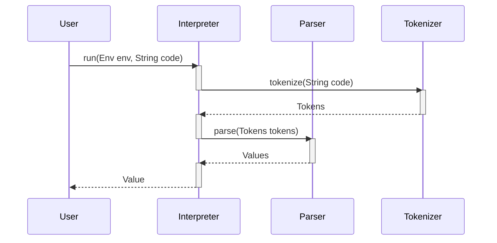
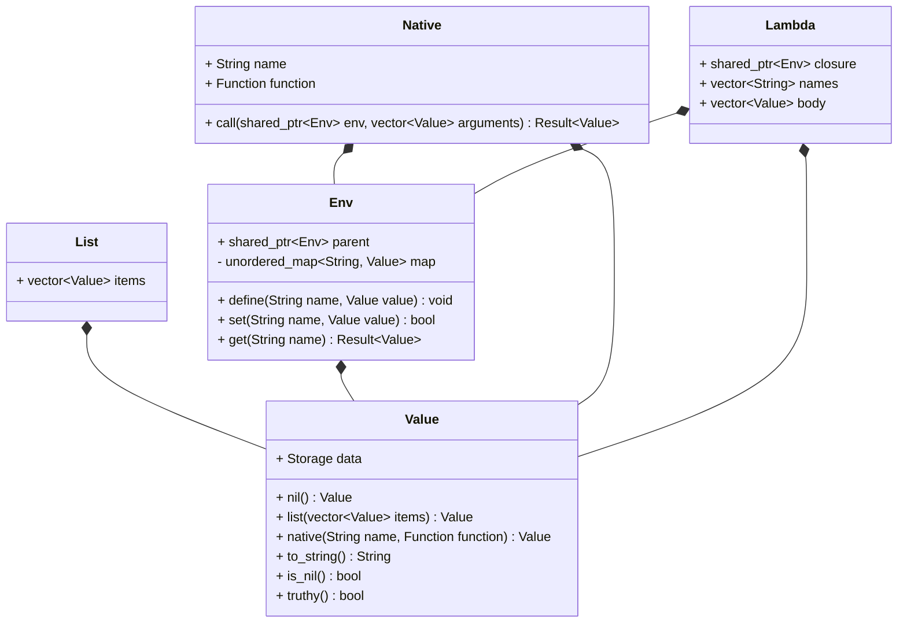

# `lisp` — Lisp interpreter in C++

## Описание

Консольная программа на C++, которая реализует интерпретатор языка программирования Lisp
в несколько этапов:

- *Токенизация* — исходный код разбивается на токены (`tokenize`);
- *Парсинг* — токены преобразуются в структуру данных, которая может быть выполнена (`parse`);
- *Выполнение* — структура данных выполняется, и результат возвращается пользователю (`eval`).

## Сторонние библиотеки

- **С++ Standard Library** — стандартная библиотека C++23 (`std`).

## Требования к системе

- CMake 3.10 или выше;
- Компилятор с поддержкой C++23 (GCC, Clang, MSVC);
- Поддерживаемые операционные системы: Linux, macOS, Windows.

## Инструкция по сборке и запуску

### Сборка

```console
$ git clone https://github.com/nekitdev/lisp.git
$ cd lisp
$ cmake -S . -B build
$ cmake --build build
```

Также предоставляются `build.sh` и `clean.sh` скрипты для сборки и очистки проекта соответственно.

### Запуск

Для запуска REPL (Read-Eval-Print-Loop):

```console
$ ./build/lisp
```

Для выполнения кода из файла:

```console
$ ./build/lisp path/to/code.lisp
```

### Docker

```console
$ docker build -t lisp .
$ docker run lisp path/to/code.lisp
```

Также предоставляется `docker.sh` скрипт для сборки и запуска контейнера.

### Тесты

Тесты реализованы с использованием фреймворка **Google Test**. Для запуска тестов:

```console
$ cmake -S . -B build -D TEST=TRUE
$ cmake --build build
$ cd build
$ ctest
```

Также предоставляется `test.sh` скрипт для сборки и запуска тестов.

## Диаграммы

### Sequence



### Class


